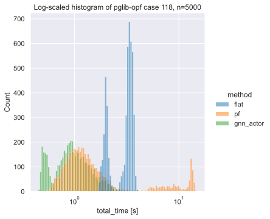

# ML-Optimized AC-OPF Warm Starts

The broad goal of this repo is to provide a framework for learning and benchmarking **machine-learning warm starts** for **AC optimal power flow (AC-OPF)** using **pandapower** with the **PandaModels/PowerModels** solver.

The current implementation follows the PPO + GNN warm-start idea from Azad Deihim et al., Initial estimate of AC optimal power flow with graph neural networks (Electric Power Systems Research, 2024), but is built as a structured and reusable framework and uses the PandaModels/PowerModels solver stack instead of the original PyPower solver. In the original paper, both the actor and critic are implemented as GNNs, and the actor predicts warm-start values for voltage magnitude, voltage angle, and active/reactive power variables before passing them to PyPower’s AC-OPF solver. Although the method they used is PPO, the underlying problem is effectively a contextual bandit rather than a sequential reinforcement-learning task, as each episode consists of a single step on an independently sampled case. Therefore, there is no temporal reward dependency over multiple steps, and the discount factor they mention has no effect in this setting.

So far, this repo implements:

- **PGLib-OPF** benchmark case import through **pandapower**
- generation of perturbed AC-OPF datasets
- **GNN + PPO** warm-start learning of the primal variables (voltage magnitude/angle, P, Q)
- optional **supervised pretraining**
- benchmarking against:
  - **flat start**
  - **power-flow warm start**

## Current benchmark snapshot

Benchmark results on **`PGLib-OPF case118`** and **`case14`**, using **paper-inspired** PPO + GNN settings based on **Deihim et al.**, using **PandaModels/PowerModels + Ipopt** instead of the original **PyPower** solver stack.

Exact configs for the runs shown here:
- [`configs/case14_ppo.toml`](configs/case14_ppo.toml)
- [`configs/case118_ppo.toml`](configs/case118_ppo.toml)


| Network | Method | Mean total time [s] | P90 total time [s] | Median total time [s] |
|---|---|---:|---:|---:|
| case118 | Flat | 2.950 | 3.640 | 3.259 |
| case118 | PF | 2.582 | 8.109 | 1.226 |
| case118 | GNN + PPO | 1.060 | 1.652 | 0.938 |
| case14 | Flat | 0.094 | 0.136 | 0.089 |
| case14 | PF | 0.068 | 0.087 | 0.067 |
| case14 | GNN + PPO | 0.070 | 0.098 | 0.065 |


All benchmark timings were measured on this machine (idle):
- OS: Fedora 44 KDE
- CPU: AMD Ryzen 7 7700X
- RAM: 16 GB
- GPU: NVIDIA RTX 4060 TI (16GB VRAM)


### Solver-time distribution


This benchmark on 5000 perturbed cases shows that the learned warm start reduces end-to-end solve time relative to both **flat** and **PF-based** initialization on `case118`. The gain is especially visible in the tail of the runtime distribution: while PF is competitive on median time, it has substantially worse **P90** behavior than the learned method. More figures, training diagnostics and a summary of the benchmark data can be found in the [docs](docs) folder.

## Supported PGLib-OPF benchmark cases

- `case14`
- `case30`
- `case118`
- `case300`
- `case118_api`
- `case118_sad`


## Installation

Install the main dependencies:

```bash
uv sync
```
Install development dependencies:

```bash
uv sync --group dev
```

## Basic workflow

List available benchmark cases:

```bash
uv run ml_acopf list-networks
```

Generate a solved dataset:

```bash
uv run ml_acopf generate-cases --config configs/default.toml
```

Run a basic hyperparameter search:

```bash
uv run ml_acopf search \
  --config configs/default.toml \
  --out outputs/search
```

Train a model:

```bash
uv run ml_acopf train \
  --config configs/default.toml \
  --out outputs/models
```

Enable supervised pretraining if desired (disabled by default):

```bash
uv run ml_acopf train \
  --config configs/default.toml \
  --out outputs/models \
  --pretrain
```

Benchmark flat, PF, and learned warm starts:

```bash
uv run ml_acopf benchmark \
  outputs/models/<run_name>/agent_ppo.pt \
  --out outputs/results
```

Create training plots for a saved run:

```bash
uv run ml_acopf plot-training outputs/models/<run_name>
```

Create benchmark plots for a saved benchmark file:

```bash
uv run ml_acopf plot-benchmark \
  outputs/results/<run_name>/<run_name>_benchmark.parquet
```

## Output layout

### Generated datasets
Case generation writes to:

```bash
data/<data.name>/baseline/
```

Layout:

- `cases.parquet` – converged case metadata
- `attempted_cases.parquet` – all attempted cases
- `load_inputs.parquet` – per-load perturbed inputs for converged cases
- `attempted_load_inputs.parquet` – per-load perturbed inputs for all attempts
- `bus_targets.parquet` – per-bus solved OPF targets
- `dispatch_targets.parquet` – per-device solved OPF targets
- `buses_static.parquet` – static bus graph features
- `edges_static.parquet` – static edge graph features
- `device_metadata.parquet` – static device features / bounds


### Training outputs
Training writes to:

```bash
outputs/models/<run_name>/
```

Layout:

- `agent_ppo.pt`
- `ppo_history.parquet`
- `pretrain_history.parquet` (if pretraining is enabled)
- training plots as PNG files

Search runs write to:

```bash
outputs/search/<run_name>/
```

### Benchmark outputs
Benchmarking writes to:

```bash
outputs/results/<run_name>/
```

Layout:

- `<run_name>_benchmark.parquet`
- `<run_name>_benchmark_summary.parquet`
- benchmark plots as PNG files
